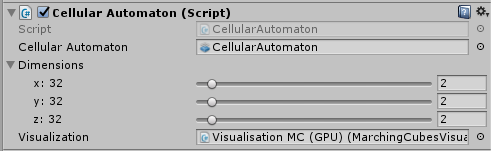
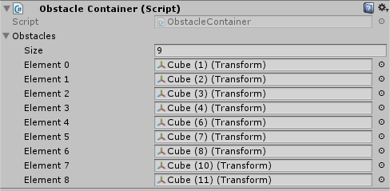
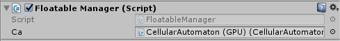
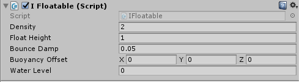

# CA-Fluid-Simulation
3D Fluid Simulation for Unity based on a Cellular Automaton

Our project contains some sample-scenes that should show you, how to use our simulation in your Unity-project. Nevertheless we show you here, how to to do it in a few steps.

## 1. The Cellular Automaton

The first thing you need is of course the cellular automaton (CA). To create a CA you need a GameObject, where you can add the [CellularAutomaton](https://github.com/Frager/CA-Fluid-Simulation/blob/master/Cellular%20Automaton%20on%20GPU/Assets/Scripts/GPU%20Fluid%20CA/CellularAutomaton.cs)-script. In the inspector you can see three items. 

The first one is a reference to the ComputeShader with the update rules for the CA. You can create your own or use ours, that is in the Resources/Compute Shader/CA folder. The second item consists of three sliders. You can set the size of the CA with these sliders. Only multiples of 16 are possible, because of the [numthreads](https://msdn.microsoft.com/de-de/library/windows/desktop/ff471442(v=vs.85).aspx)-settings in the ComputeShader. The last item is a reference to a GameObject with the [GPUVisualisation](https://github.com/Frager/CA-Fluid-Simulation/blob/master/Cellular%20Automaton%20on%20GPU/Assets/Scripts/GPU%20Fluid%20CA/Visualisation/GPUVisualisation.cs)-script or a subclass.

## 2. The Input of the Cellular Automaton

Now we have an empty CA and nothing happens, because we don't fill something in. This is done by the [GPUFluidManager](https://github.com/Frager/CA-Fluid-Simulation/blob/master/Cellular%20Automaton%20on%20GPU/Assets/Scripts/GPU%20Fluid%20CA/GPUFluidManager.cs)-script.

This class has a little bit more itmes. The first reference is just a reference to GameObject, we created in the first step, the one with the CA. The next two items are optional and only relevant if you use static obstacles. You can find an introduction below. The Timeframe-slider determines how often the ca performs an update, in this example every 0.01 seconds. The next three sliders determine the position, where fluid is filled in. They are in a range from 0 till 1, so that they don't depend on the Dimension-setting in the CA. Be careful, since the borders of our CA are blocked values near 0 or 1 will cause, that no fluid is filled in. Now we fill something in, but we don't know what. That is chosen by the Element-dropdown. At the moment we have three default elements: Water, oil and gas, but of course you can create your own elements. You can find an introduction below.

## 3. The Visualisation 

We already mentioned the [GPUVisualisation](https://github.com/Frager/CA-Fluid-Simulation/blob/master/Cellular%20Automaton%20on%20GPU/Assets/Scripts/GPU%20Fluid%20CA/Visualisation/GPUVisualisation.cs) used in the [CellularAutomaton](https://github.com/Frager/CA-Fluid-Simulation/blob/master/Cellular%20Automaton%20on%20GPU/Assets/Scripts/GPU%20Fluid%20CA/CellularAutomaton.cs)-script. Until now we have a CA and we fill some fluid in, but we still see nothing, because we have no visualisation. That is why we need a visualisation, for example our [MarchingCubesVisualisation](https://github.com/Frager/CA-Fluid-Simulation/blob/master/Cellular%20Automaton%20on%20GPU/Assets/Scripts/GPU%20Fluid%20CA/Visualisation/MarchingCubesVisualisation.cs).

The fist thing you have to do, is to add this script to your camera. This is neccessary because the script uses the [OnPostRender](https://docs.unity3d.com/ScriptReference/MonoBehaviour.OnPostRender.html) method. The next item is the Offset-vector that determines where the fluid will be rendered in WorldSpace. This can't be changed at runtime. The Scale-vector indicates the size of the visualisation. This is of course independent from the size of the cellular automaton, which only determines the number of cells and therefore determines how finely the fluid is rendered. For better control the size and position of the visualisation is rendered as an gizmo in the scene view.

The next item is a dropdown for the type of rendering. At the moment there are four options: CUBES, SIMPLE, TESSELATION and MULTIPLE\_FLUIDS. CUBES produces a voxelised visualisation. SIMPLE generates a smoother mesh and TESSELATION a mesh with more polygons, that should give a more wavy look. MULTIPLE\_FLUIDS is intended to visualize several liquids, better than the other types. The last dropdown sets the shading type. You can use between the three standard types: FLAT, GOURAUD and PHONG.

----------

## Adding Static Obstacles

Static obstacles are objects that block fluids and are not moved by them, like walls. Using static obstacles is very simple. All you need is one script, the [ObstacleContainer](https://github.com/Frager/CA-Fluid-Simulation/blob/master/Cellular%20Automaton%20on%20GPU/Assets/Scripts/GPU%20Fluid%20CA/Interfaces/ObstacleContainer.cs).

All the objects you want to have as an obstacle must be set in the "Obstacles" array in the [ObstacleContainer](https://github.com/Frager/CA-Fluid-Simulation/blob/master/Cellular%20Automaton%20on%20GPU/Assets/Scripts/GPU%20Fluid%20CA/Interfaces/ObstacleContainer.cs) script. NOTE: At the moment only cubic objects are fully supported. Finally the reference to the [ObstacleContainer](https://github.com/Frager/CA-Fluid-Simulation/blob/master/Cellular%20Automaton%20on%20GPU/Assets/Scripts/GPU%20Fluid%20CA/Interfaces/ObstacleContainer.cs) must be set in the [GPUFluidManager](https://github.com/Frager/CA-Fluid-Simulation/blob/master/Cellular%20Automaton%20on%20GPU/Assets/Scripts/GPU%20Fluid%20CA/GPUFluidManager.cs). It is also possible to remove these obstacles at runtime, when you put another [ObstacleContainer](https://github.com/Frager/CA-Fluid-Simulation/blob/master/Cellular%20Automaton%20on%20GPU/Assets/Scripts/GPU%20Fluid%20CA/Interfaces/ObstacleContainer.cs) in the reference field "Remove Obstacles" in the [GPUFluidManager](https://github.com/Frager/CA-Fluid-Simulation/blob/master/Cellular%20Automaton%20on%20GPU/Assets/Scripts/GPU%20Fluid%20CA/GPUFluidManager.cs). Of course, all GameObjects inside the "Obstacles" array of the new [ObstacleContainer](https://github.com/Frager/CA-Fluid-Simulation/blob/master/Cellular%20Automaton%20on%20GPU/Assets/Scripts/GPU%20Fluid%20CA/Interfaces/ObstacleContainer.cs) have to be in the old one.

## Fluid-Solid Interaction

Fluid-solid interaction means in our simulation, that GameObjects are moved by the fluids. The first thing you need is a GameObject with the [FloatableManager](https://github.com/Frager/CA-Fluid-Simulation/blob/master/Cellular%20Automaton%20on%20GPU/Assets/Scripts/GPU%20Fluid%20CA/Interfaces/FloatableManager.cs) script attached.

The only paramter you need is a reference to the [CellularAutomaton](https://github.com/Frager/CA-Fluid-Simulation/blob/master/Cellular%20Automaton%20on%20GPU/Assets/Scripts/GPU%20Fluid%20CA/CellularAutomaton.cs). Now every GameObject that should be affetced by water must have a [IFloatable](https://github.com/Frager/CA-Fluid-Simulation/blob/master/Cellular%20Automaton%20on%20GPU/Assets/Scripts/GPU%20Fluid%20CA/Interfaces/IFloatable.cs) script attached.

You can see five paramters that determine the behaviour of the GameObject. The "Density" is the most important one, since it influences on what type of fluid the GameObjects floats. For example the density value 2 means, that an object only floats on fluids with a density greater or equal 2. The "Float Height" can be used to indicate how high a floating object should protrude from the fluid.

## Extending the Simulation by your own Fluids